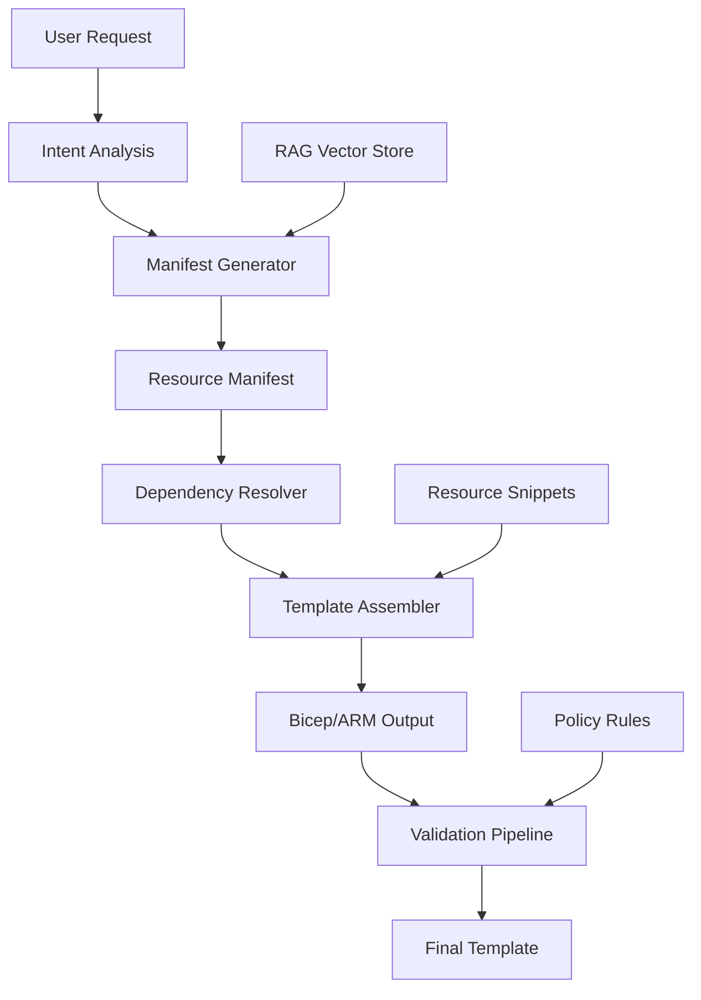

# Enhanced AI Provider Architecture
*Incorporating Advanced Template Generation & Responsible AI Guardrails*

## Executive Summary

This document outlines the enhanced AI provider architecture for the Azure Marketplace Generator, incorporating advanced manifest-first generation, retrieval-augmented generation (RAG), and comprehensive validation pipelines. The architecture prioritizes Azure OpenAI as the primary engine with responsible AI guardrails while maintaining offline capabilities and enterprise-grade security.

## 1. AI Engine Strategy

### Primary Engine: Azure OpenAI
- **Models**: GPT-4.1 Turbo or GPT-4o
- **Deployment**: Private network with VNet integration
- **Features**:
  - Responsible AI guardrails enabled
  - Azure compliance and data residency
  - Rate limiting and quota management
  - Streaming support for responsive CLI experience
  - Content filtering and safety mechanisms

### Fallback Engine: Lightweight Open Source
- **Models**: Phi-3 or Code Llama (small variants)
- **Purpose**: Offline work and development scenarios
- **Deployment**: Local inference with ONNX runtime
- **Use Cases**:
  - Development environments without internet
  - Basic template scaffolding
  - Syntax validation and formatting

### Avoided Solutions
- **GitHub Copilot API**: Excluded due to:
  - IDE-optimized completions vs. structured template generation
  - Limited control over prompts and fine-tuning
  - Reduced data residency control
  - Less suitable for deterministic manifest generation

## 2. Manifest-First Generation Architecture

### 2.1 Generation Pipeline



### 2.2 Manifest Structure

```typescript
interface ResourceManifest {
  metadata: {
    templateType: string;
    version: string;
    complexity: 'simple' | 'medium' | 'complex';
    targetScope: 'resourceGroup' | 'subscription' | 'managementGroup';
  };

  architecture: {
    resources: ResourceDefinition[];
    dependencies: DependencyGraph;
    parameters: ParameterDefinition[];
    modules: ModuleReference[];
  };

  security: {
    identityScope: string[];
    networkIsolation: boolean;
    secretsHandling: string[];
    complianceRequirements: string[];
  };

  deployment: {
    strategy: 'single' | 'nested' | 'modular';
    sequencing: DeploymentStage[];
    rollback: RollbackStrategy;
  };
}
```

### 2.3 Deterministic Assembler

The assembler takes the manifest and applies deterministic rules:

```typescript
class TemplateAssembler {
  async assemble(manifest: ResourceManifest): Promise<BicepTemplate> {
    // 1. Resolve dependency DAG (leaf to root)
    const dependencyOrder = this.resolveDependencyDAG(manifest.architecture.dependencies);

    // 2. Apply naming conventions
    const nameResolver = new NamingConventionResolver(manifest.metadata);

    // 3. Stitch resource snippets
    const template = new BicepTemplate();

    for (const resourceDef of dependencyOrder) {
      const snippet = await this.retrieveResourceSnippet(resourceDef.type);
      const configuredSnippet = this.applyConfiguration(snippet, resourceDef, nameResolver);
      template.addResource(configuredSnippet);
    }

    // 4. Generate nested deployments for complex scenarios
    if (manifest.metadata.complexity === 'complex') {
      template = await this.convertToNestedDeployments(template, manifest.deployment);
    }

    return template;
  }
}
```

## 3. Retrieval-Augmented Generation (RAG)

### 3.1 Vector Store Strategy

**Approach**: Train via retrieval, not fine-tuning
- Index trusted internal Azure samples
- Well-Architected Framework guidance
- Cloud Adoption Framework blueprints
- Past validated templates
- Resource-specific best practices

### 3.2 Vector Store Schema

```typescript
interface KnowledgeChunk {
  id: string;
  content: string;
  metadata: {
    source: 'azure-samples' | 'waf' | 'caf' | 'validated-template' | 'best-practice';
    resourceType: string[];
    scenario: string[];
    complexity: number;
    lastUpdated: Date;
    validation: {
      armTtkPassed: boolean;
      policyCompliant: boolean;
      securityReviewed: boolean;
    };
  };
  embedding: number[];
  tags: string[];
}
```

### 3.3 Retrieval Pipeline

```typescript
class RAGRetriever {
  async retrieveRelevantChunks(
    query: string,
    resourceTypes: string[],
    maxChunks: number = 5
  ): Promise<KnowledgeChunk[]> {
    // 1. Generate query embedding
    const queryEmbedding = await this.embedQuery(query);

    // 2. Vector similarity search with metadata filtering
    const results = await this.vectorStore.search({
      embedding: queryEmbedding,
      filters: {
        resourceType: { $in: resourceTypes },
        'metadata.validation.armTtkPassed': true
      },
      limit: maxChunks
    });

    // 3. Re-rank by recency and validation status
    return this.reRankByQuality(results);
  }
}
```

## 4. Layered Validation Pipeline

### 4.1 Validation Stages

```typescript
interface ValidationPipeline {
  stages: [
    {
      name: 'schema-validation';
      validator: SchemaValidator;
      failFast: true;
    },
    {
      name: 'arm-ttk-validation';
      validator: ArmTtkValidator;
      failFast: true;
    },
    {
      name: 'policy-validation';
      validator: PolicyAsCodeValidator;
      failFast: false;
    },
    {
      name: 'security-scan';
      validator: SecurityScanner;
      failFast: false;
    },
    {
      name: 'what-if-deployment';
      validator: WhatIfValidator;
      failFast: false;
    },
    {
      name: 'threat-modeling';
      validator: ThreatModelingValidator;
      failFast: false;
    }
  ];
}
```

### 4.2 Validation Implementations

#### Schema & ARM-TTK Validation
```typescript
class SchemaValidator implements TemplateValidator {
  async validate(template: BicepTemplate): Promise<ValidationResult> {
    // 1. Bicep build check
    const buildResult = await this.bicepCompiler.build(template);
    if (!buildResult.success) {
      return this.createFailureResult('build-error', buildResult.errors);
    }

    // 2. ARM-TTK validation
    const armTemplate = buildResult.armTemplate;
    const ttkResult = await this.armTtk.test(armTemplate);

    return this.createValidationResult(ttkResult);
  }
}
```

#### Policy-as-Code Validation
```typescript
class PolicyAsCodeValidator implements TemplateValidator {
  async validate(template: BicepTemplate): Promise<ValidationResult> {
    const violations: PolicyViolation[] = [];

    // Enforce security policies
    const securityChecks = [
      this.enforcePrivateEndpoints(template),
      this.enforceManagedIdentities(template),
      this.enforceEncryption(template),
      this.enforceNetworkIsolation(template)
    ];

    for (const check of securityChecks) {
      const result = await check;
      if (!result.compliant) {
        violations.push(...result.violations);
      }
    }

    return new ValidationResult(violations.length === 0, violations);
  }
}
```

#### Security & Secrets Scanner
```typescript
class SecurityScanner implements TemplateValidator {
  async validate(template: BicepTemplate): Promise<ValidationResult> {
    const issues: SecurityIssue[] = [];

    // 1. Static secrets scan
    issues.push(...await this.scanForHardcodedSecrets(template));

    // 2. Identity scope validation
    issues.push(...await this.validateIdentityScopes(template));

    // 3. Network security validation
    issues.push(...await this.validateNetworkSecurity(template));

    return new ValidationResult(issues.length === 0, issues);
  }
}
```

### 4.3 Auto-Remediation Loop

```typescript
class ValidationOrchestrator {
  async validateWithRemediation(
    template: BicepTemplate,
    maxRetries: number = 3
  ): Promise<ValidatedTemplate> {
    let currentTemplate = template;

    for (let attempt = 0; attempt < maxRetries; attempt++) {
      const validationResult = await this.runValidationPipeline(currentTemplate);

      if (validationResult.isValid) {
        return new ValidatedTemplate(currentTemplate, validationResult);
      }

      // Auto-remediation via AI
      const remediationPrompt = this.buildRemediationPrompt(
        currentTemplate,
        validationResult.issues
      );

      currentTemplate = await this.aiProvider.remediate(remediationPrompt);
    }

    throw new ValidationError('Max remediation attempts exceeded', validationResult.issues);
  }
}
```

## 5. Implementation Roadmap

### Phase 0: Architecture Design (Week 1-2)
- ✅ AI service abstraction layer
- ✅ Manifest schema definition
- ✅ Validation pipeline contracts
- ✅ Vector store schema design

### Phase 1: AI & Retrieval Foundation (Week 3-6)
- **Azure OpenAI Integration**
  - Private network deployment
  - Responsible AI guardrails configuration
  - Streaming support implementation
  - Rate limiting and monitoring

- **RAG Implementation**
  - Vector store setup (Azure AI Search)
  - Knowledge base indexing pipeline
  - Retrieval service implementation
  - Prompt template system

### Phase 2: Manifest-First Generation (Week 7-10)
- **Manifest Generator**
  - Intent analysis and resource planning
  - Dependency graph construction
  - Parameter inference engine

- **Template Assembler**
  - Resource snippet library
  - Deterministic assembly logic
  - Naming convention engine
  - Nested deployment generation

### Phase 3: Validation & Guardrails (Week 11-14)
- **Validation Pipeline**
  - Schema and ARM-TTK integration
  - Policy-as-code enforcement
  - Security scanning implementation
  - What-if deployment validation

- **Auto-Remediation**
  - Issue classification system
  - Remediation prompt generation
  - Feedback loop implementation

### Phase 4: Architecture Intelligence (Week 15-18)
- **Optimization Engine**
  - Performance analysis
  - Cost optimization recommendations
  - Security posture improvements
  - Well-Architected alignment

### Phase 5: Competitive Intelligence (Week 19-22)
- **Market Intelligence**
  - Marketplace data integration
  - Competitive analysis automation
  - Template differentiation engine
  - Success metrics tracking

## 6. Technical Implementation

### 6.1 AI Provider Interface

```typescript
interface EnhancedAIProvider {
  // Core generation
  generateManifest(request: GenerationRequest): Promise<ResourceManifest>;
  assembleTemplate(manifest: ResourceManifest): Promise<BicepTemplate>;

  // Validation & remediation
  validateTemplate(template: BicepTemplate): Promise<ValidationResult>;
  remediateIssues(template: BicepTemplate, issues: ValidationIssue[]): Promise<BicepTemplate>;

  // Intelligence features
  optimizeArchitecture(template: BicepTemplate): Promise<OptimizationSuggestions>;
  analyzeCompliance(template: BicepTemplate): Promise<ComplianceReport>;

  // RAG integration
  enhanceWithKnowledge(query: string, context: RAGContext): Promise<EnhancedResponse>;
}
```

### 6.2 Configuration Schema

```typescript
interface AIProviderConfig {
  primary: {
    provider: 'azure-openai';
    endpoint: string;
    model: 'gpt-4-turbo' | 'gpt-4o';
    apiVersion: string;
    deployment: string;
    features: {
      responsibleAI: boolean;
      contentFiltering: boolean;
      streaming: boolean;
      rateLimiting: RateLimitConfig;
    };
  };

  fallback: {
    provider: 'local-phi' | 'local-codellama';
    modelPath: string;
    runtime: 'onnx' | 'ollama';
    capabilities: string[];
  };

  rag: {
    vectorStore: {
      provider: 'azure-ai-search';
      endpoint: string;
      indexName: string;
    };
    retrieval: {
      maxChunks: number;
      similarityThreshold: number;
      reRankingEnabled: boolean;
    };
  };

  validation: {
    armTtkPath: string;
    policyDefinitions: string[];
    securityRules: SecurityRuleConfig[];
    whatIfEnabled: boolean;
  };
}
```

## 7. Security & Compliance

### 7.1 Data Protection
- All AI interactions use private Azure OpenAI deployment
- No data sent to external services
- Vector store encrypted at rest
- Audit logging for all AI operations

### 7.2 Responsible AI Implementation
- Content filtering for malicious code generation
- Bias detection in architecture recommendations
- Explainability for AI-generated decisions
- Human oversight for critical security components

### 7.3 Compliance Alignment
- SOC 2 Type II compliance
- ISO 27001 alignment
- Azure compliance framework integration
- Data residency requirements met

## 8. Success Metrics

### 8.1 Quality Metrics
- Template validation pass rate: >95%
- Security compliance score: >90%
- Performance optimization effectiveness: >20% cost reduction
- User satisfaction score: >4.5/5

### 8.2 Performance Metrics
- Generation time: <30 seconds for complex templates
- Validation pipeline execution: <2 minutes
- RAG retrieval latency: <500ms
- Overall CLI responsiveness: <5 seconds for most operations

### 8.3 Business Metrics
- Template deployment success rate: >98%
- Customer adoption of AI-generated templates: >70%
- Support ticket reduction: >40%
- Time-to-production improvement: >60%

---

*This enhanced architecture positions the Azure Marketplace Generator as the premier AI-powered infrastructure-as-code platform, delivering enterprise-grade security, compliance, and performance while maintaining the flexibility and power users expect.*