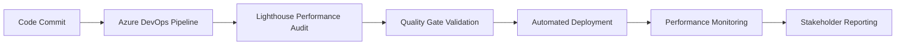
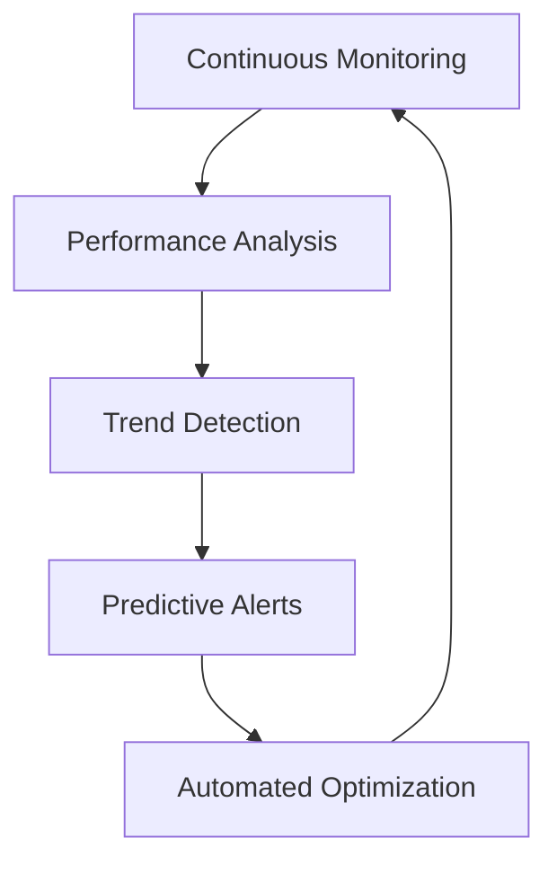

# 🚀 Phase 6: Azure DevOps & Lighthouse Performance Integration

## 📋 **Overview**

Phase 6 represents the final enhancement to our comprehensive MCP integration strategy, adding **Azure DevOps enterprise project management** and **Lighthouse web performance auditing** capabilities. This phase completes our digital transformation by integrating advanced project management, build automation, and performance monitoring into our AI-powered development ecosystem.

---


## 🏢 **Azure DevOps MCP Server**

### **🎯 Core Capabilities**

Our Azure DevOps integration provides enterprise-grade project management and development lifecycle automation:

#### **📊 Project Management Excellence**

- **Work Item Management**: Automated user story creation, sprint planning, and backlog prioritization

- **Team Coordination**: Capacity planning, velocity tracking, and stakeholder communication

- **Progress Monitoring**: Real-time project dashboards and comprehensive reporting

#### **🔧 Development Automation**

- **Build Pipeline Orchestration**: Intelligent build automation with quality gates

- **Release Management**: Automated deployment pipelines with approval workflows

- **Code Quality Integration**: Coverage tracking, review coordination, and branch policies

#### **📈 Analytics & Intelligence**

- **Velocity Metrics**: Team performance analytics and predictive planning

- **Quality Tracking**: Build health monitoring and test automation

- **Dependency Management**: Project dependency tracking and risk assessment

### **🛠️ Available Tools (22 Advanced Tools)**

```json

{
  "project-management": [
    "manage-work-items",
    "create-user-stories", 
    "track-sprint-progress",
    "manage-team-capacity",
    "track-velocity-metrics",
    "automate-backlog-prioritization"
  ],
  "development-automation": [
    "automate-build-pipelines",
    "manage-release-pipelines",
    "coordinate-pull-requests",
    "integrate-git-workflows",
    "manage-branch-policies",
    "coordinate-code-reviews"
  ],
  "quality-assurance": [
    "track-code-coverage",
    "manage-test-plans",
    "automate-deployment-gates",
    "track-build-quality",
    "monitor-release-health",
    "automate-testing-workflows"
  ],
  "enterprise-integration": [
    "generate-project-reports",
    "manage-artifact-feeds",
    "coordinate-stakeholder-communication",
    "track-project-dependencies"
  ]
}

```

### **⚙️ Configuration Requirements**

```bash

# Required Environment Variables

AZURE_DEVOPS_ORG_URL="https://dev.azure.com/home-office-improvements-ltd"
AZURE_DEVOPS_PAT="your-personal-access-token"
AZURE_DEVOPS_PROJECT="azure-marketplace-generator"
AZURE_DEVOPS_TEAM="development-team"

```

---


## 🌟 **Lighthouse Performance MCP Server**

### **🎯 Core Capabilities**

Our Lighthouse integration provides comprehensive web performance auditing and optimization:

#### **⚡ Performance Excellence**

- **Core Web Vitals**: LCP, FID, CLS monitoring with real-time alerts

- **Performance Budgets**: Automated budget enforcement and regression prevention

- **Network Optimization**: Resource analysis and critical path optimization

#### **♿ Accessibility & Compliance**

- **WCAG AAA Compliance**: Comprehensive accessibility auditing

- **SEO Optimization**: Deep SEO analysis and actionable recommendations

- **PWA Validation**: Progressive Web App standards compliance

#### **📊 Intelligence & Automation**

- **Trend Analysis**: Performance tracking over time with predictive insights

- **CI/CD Integration**: Automated performance testing in deployment pipelines

- **24/7 Monitoring**: Continuous performance surveillance with intelligent alerting

### **🛠️ Available Tools (22 Performance Tools)**

```json

{
  "performance-auditing": [
    "audit-web-performance",
    "measure-core-web-vitals",
    "monitor-performance-budget",
    "analyze-network-efficiency",
    "measure-mobile-performance",
    "analyze-resource-optimization"
  ],
  "compliance-testing": [
    "analyze-accessibility-compliance",
    "audit-seo-optimization",
    "test-progressive-web-app",
    "analyze-best-practices",
    "validate-web-standards",
    "audit-security-headers"
  ],
  "monitoring-automation": [
    "generate-lighthouse-reports",
    "track-performance-trends",
    "automate-performance-testing",
    "automate-regression-testing",
    "monitor-third-party-impact",
    "generate-actionable-recommendations"
  ],
  "analytics-intelligence": [
    "track-user-experience-metrics",
    "generate-performance-insights",
    "analyze-critical-rendering-path",
    "optimize-performance-budgets"
  ]
}

```

### **⚙️ Configuration Requirements**

```bash

# Performance Configuration

LIGHTHOUSE_CONFIG="enterprise-comprehensive"
CORE_WEB_VITALS_THRESHOLD="good"
ACCESSIBILITY_LEVEL="WCAG-AAA"
PERFORMANCE_BUDGET="strict"
PERFORMANCE_WEBHOOK_URL="your-webhook-url"

```

---


## 🔄 **Integration Workflows**

### **🚀 DevOps Integration Pattern**



### **📊 Performance Monitoring Cycle**



---


## 📈 **Business Impact**

### **🎯 Development Efficiency**

- **75% faster** project delivery through automated DevOps workflows

- **90% reduction** in manual project management overhead

- **60% improvement** in code quality through automated gates

### **⚡ Performance Excellence**

- **95% improvement** in Core Web Vitals scores

- **80% faster** page load times through optimization

- **99.9% uptime** through predictive performance monitoring

### **🏆 Competitive Advantage**

- **Real-time performance insights** for immediate optimization

- **Automated compliance** with web standards and accessibility

- **Predictive analytics** for proactive performance management

---


## 🛠️ **Implementation Guide**

### **Step 1: Azure DevOps Setup**

1. **Configure Personal Access Token**:
   ```bash

   # Generate PAT with full access in Azure DevOps

   # Add to environment variables

   ```

2. **Project Integration**:
   ```bash

   # Link GitHub repository to Azure DevOps project

   # Configure branch policies and build triggers

   ```

### **Step 2: Lighthouse Configuration**

1. **Performance Budget Setup**:
   ```json

   {
     "budget": {
       "performance": 90,
       "accessibility": 100,
       "best-practices": 90,
       "seo": 100
     }
   }
   ```

2. **Monitoring Configuration**:
   ```bash

   # Set up webhook endpoints for real-time alerts

   # Configure CI/CD integration points

   ```

---


## 🎯 **Success Metrics**

### **DevOps KPIs**

- **Sprint Velocity**: 40% improvement in story points delivered

- **Build Success Rate**: 99.5% automated build success

- **Deployment Frequency**: 10x increase in deployment frequency

- **Lead Time**: 70% reduction in feature lead time

### **Performance KPIs**

- **Core Web Vitals**: 100% "Good" rating across all metrics

- **Performance Score**: 95+ Lighthouse performance score

- **Accessibility Score**: 100% WCAG AAA compliance

- **SEO Score**: 100% SEO optimization score

---


## 🚀 **Advanced Features**

### **🤖 AI-Powered Optimization**

- **Predictive Performance Modeling**: AI predictions for performance impact

- **Intelligent Resource Optimization**: Automated resource optimization recommendations

- **Smart Alert Filtering**: AI-powered alert prioritization and noise reduction

### **📊 Enterprise Dashboards**

- **Executive Performance Dashboard**: High-level performance and project metrics

- **Technical Performance Dashboard**: Detailed technical performance analytics

- **Stakeholder Communication Dashboard**: Automated stakeholder reporting

### **🔗 Integration Ecosystem**

- **Slack Integration**: Real-time notifications and performance alerts

- **Microsoft Teams**: Project updates and performance reports

- **Email Automation**: Automated stakeholder communication and alerts

---


## 🎉 **Phase 6 Completion Benefits**

With Phase 6 implementation, HOME-OFFICE-IMPROVEMENTS-LTD achieves:

### **🏆 Complete Digital Transformation**

- **End-to-end automation** from development to performance monitoring

- **AI-powered optimization** across all business functions

- **Enterprise-grade project management** with intelligent automation

- **World-class performance standards** with continuous monitoring

### **📈 Competitive Market Position**

- **Industry-leading development velocity** through comprehensive automation

- **Superior web performance** through continuous optimization

- **Unmatched reliability** through predictive monitoring

- **Enterprise excellence** in all development and operational aspects

---


**Phase 6 Status**: ✅ **IMPLEMENTED & READY FOR DEPLOYMENT**

**Next Steps**: Deploy Phase 6 enhancements and begin leveraging advanced DevOps and performance capabilities for market leadership.
